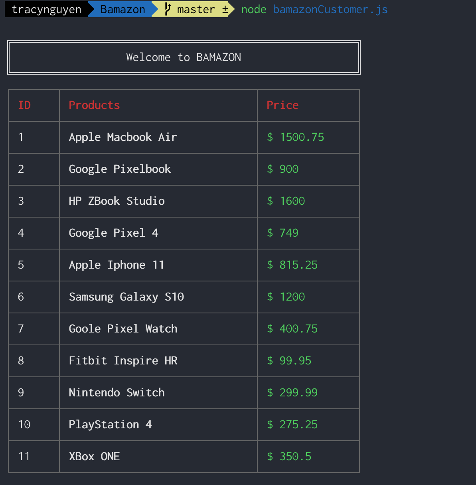
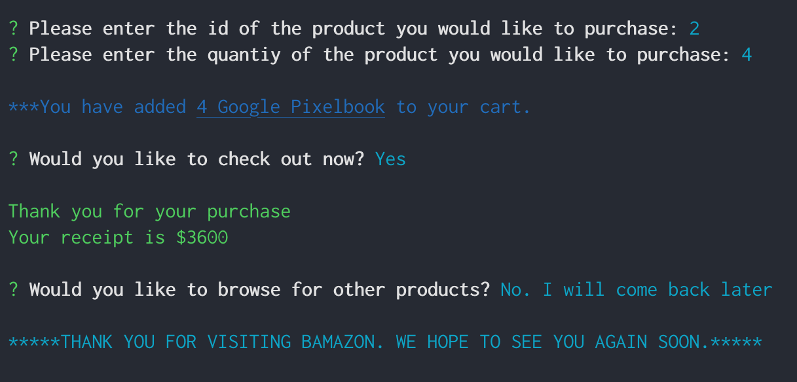
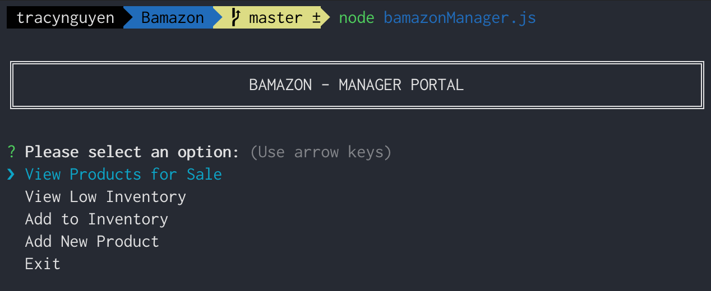
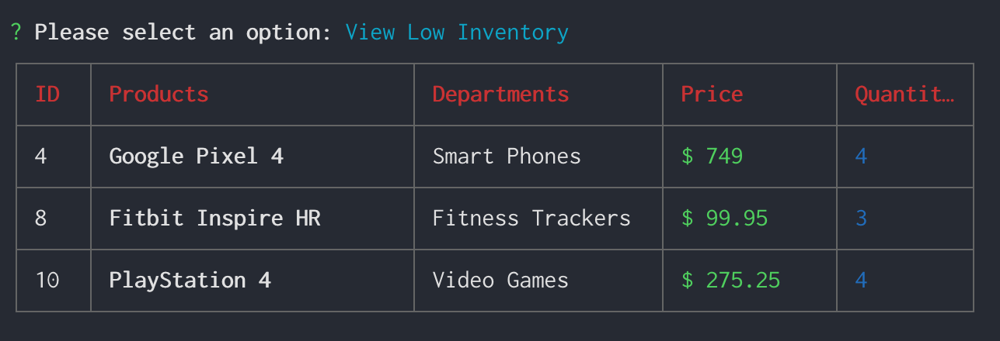
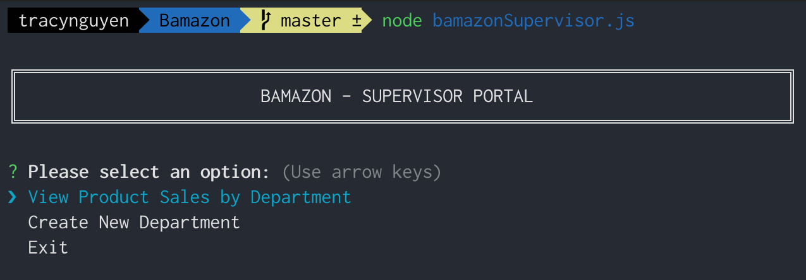
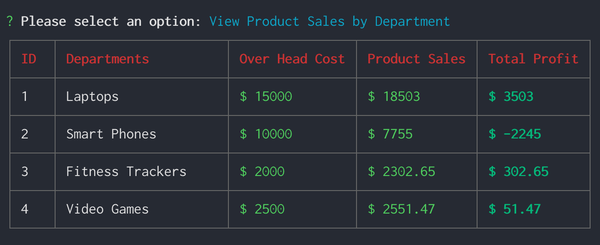
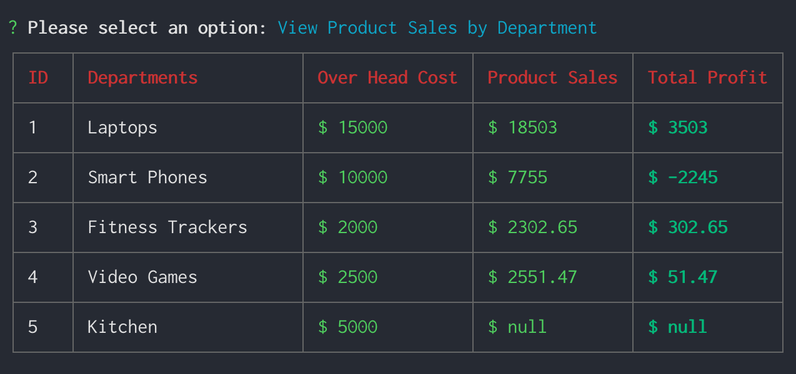

# Bamazon

> Bamazon is Amazon-like CLI storefront build with Node.js and MySQL.

<!-- toc -->

- [Overview](#Overview)
- [Set Up](#Set-Up)
- [Project Screenshots](#Project-Screenshots)
  * [Customer View](#Customer-View)
  * [Manager View](#Manager-View)
  * [Supervisor View](#Supervisor-View)
- [Instructions](#Instructions)
  * [Challenge #1: Customer View (Minimum Requirement)](#Challenge-1-Customer-View-Minimum-Requirement)
  * [Challenge #2: Manager View (Next Level)](#Challenge-2-Manager-View-Next-Level)
  * [Challenge #3: Supervisor View (Final Level)](#Challenge-3-Supervisor-View-Final-Level)

<!-- tocstop -->

-----

## Overview

Three bamazon apps were build in this project: `customer view`, `manager view`, and `supervisor view`.

-----

## Set Up

To run this project:

1. Clone repo
2. Run `npm install`
3. Run the apps **bamazonCustomer.js**, **bamazonManager.js** or **bamazonSupervisor.js** in command prompt.

-----

## Project Screenshots

### 1. Customer View

- Running the app `bamazonCustomer.js` will first display all products available for sale:

- The app then prompt users to enter **ID** and **quantity** of the product they'd like to purchase.
- ...if the stock quantity is insufficient, the app will responsd to users:
  

  
- ...if we have enough stock, the app will fulfill the order, update MySQL database and show users the total cost (receipt): 

### 2. Manager View

- Running the app `bamazonManager.js` will first list a set of menu options:

- *View Products for Sale* will list all available products:

- *View Low Inventory* will list items with stock quantity lower than five:

- *Add to Inventory* will display a prompt that let the manager add more inventory to selected product:

- *Add New Product* will display a prompt that let the manager create a new row of new product in MySQL table:

### 3. Supervisor View

- Running the app `bamazonSupervisor.js` will first list a set of menu options:

- *View Product Sales by Department* will display a custom table that is build from LEFT JOIN *departments* table to *products* table: 

- *Create New Department* will let the supervisor insert a new row of new department in *departments* table:

-----

## Instructions

### Challenge #1: Customer View (Minimum Requirement)

1. Create a MySQL Database called `bamazon`.

2. Then create a Table inside of that database called `products`.

3. The products table should have each of the following columns:

   * item_id (unique id for each product)

   * product_name (Name of product)

   * department_name

   * price (cost to customer)

   * stock_quantity (how much of the product is available in stores)

4. Populate this database with around 10 different products. (i.e. Insert "mock" data rows into this database and table).

5. Then create a Node application called `bamazonCustomer.js`. Running this application will first display all of the items available for sale. Include the ids, names, and prices of products for sale.

6. The app should then prompt users with two messages.

   * The first should ask them the ID of the product they would like to buy.
   * The second message should ask how many units of the product they would like to buy.

7. Once the customer has placed the order, your application should check if your store has enough of the product to meet the customer's request.

   * If not, the app should log a phrase like `Insufficient quantity!`, and then prevent the order from going through.

8. However, if your store _does_ have enough of the product, you should fulfill the customer's order.
   * This means updating the SQL database to reflect the remaining quantity.
   * Once the update goes through, show the customer the total cost of their purchase.

- - -

### Challenge #2: Manager View (Next Level)

* Create a new Node application called `bamazonManager.js`. Running this application will:

  * List a set of menu options:

    * View Products for Sale
    
    * View Low Inventory
    
    * Add to Inventory
    
    * Add New Product

  * If a manager selects `View Products for Sale`, the app should list every available item: the item IDs, names, prices, and quantities.

  * If a manager selects `View Low Inventory`, then it should list all items with an inventory count lower than five.

  * If a manager selects `Add to Inventory`, your app should display a prompt that will let the manager "add more" of any item currently in the store.

  * If a manager selects `Add New Product`, it should allow the manager to add a completely new product to the store.

- - -

### Challenge #3: Supervisor View (Final Level)

1. Create a new MySQL table called `departments`. Your table should include the following columns:

   * department_id

   * department_name

   * over_head_costs (A dummy number you set for each department)

2. Modify the products table so that there's a product_sales column, and modify your `bamazonCustomer.js` app so that when a customer purchases anything from the store, the price of the product multiplied by the quantity purchased is added to the product's product_sales column.

   * Make sure your app still updates the inventory listed in the `products` column.

3. Create another Node app called `bamazonSupervisor.js`. Running this application will list a set of menu options:

   * View Product Sales by Department
   
   * Create New Department

4. When a supervisor selects `View Product Sales by Department`, the app should display a summarized table in their terminal/bash window. Use the table below as a guide.

| department_id | department_name | over_head_costs | product_sales | total_profit |
| ------------- | --------------- | --------------- | ------------- | ------------ |
| 01            | Electronics     | 10000           | 20000         | 10000        |
| 02            | Clothing        | 60000           | 100000        | 40000        |

5. The `total_profit` column should be calculated on the fly using the difference between `over_head_costs` and `product_sales`. `total_profit` should not be stored in any database. You should use a custom alias.

6. If you can't get the table to display properly after a few hours, then feel free to go back and just add `total_profit` to the `departments` table.

   * Hint: You may need to look into aliases in MySQL.

   * Hint: You may need to look into GROUP BYs.

   * Hint: You may need to look into JOINS.

   * **HINT**: There may be an NPM package that can log the table to the console. What's is it? Good question :)